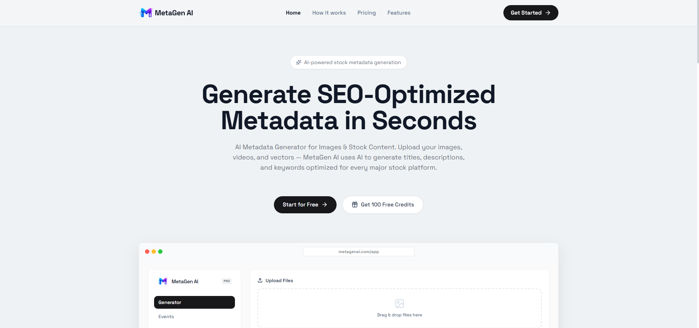

# AI Meta Generator ✨

Welcome to **AI Meta Generator** — a powerful, modern, and feature-rich monorepo application designed to streamline image processing, AI generation, and asset management for creators, marketers, and developers.

Built with cutting-edge web technologies, this platform offers a stunning **Glassmorphism UI** with seamless interactions and enterprise-grade architecture.

### 🌐 Live Demo
**[https://metagen-ai-bd.vercel.app/](https://metagen-ai-bd.vercel.app/)**



---

## 🚀 Key Features

### 🎨 Creative Tools
* **AI Meta/Image Generator**: Leverage advanced AI models (Vision/LLMs via OpenRouter/Gemini) to analyze images and generate high-quality metadata, captions, and descriptions.
* **Batch Image Converter**: A powerful, 100% offline client-side converter. Upload multiple images and instantly convert them between `JPG`, `PNG`, `WEBP`, `AVIF`, and `PDF`.
* **Trace to Vector (SVG)**: Convert raster images (JPG/PNG) into pure mathematical SVG vectors using advanced geometric tracing algorithms—all happening locally in your browser.
* **Color Palette Extractor**: Instantly extract beautiful, harmonious color palettes and HEX codes from any uploaded image using intelligent color sampling.

### 📊 Management & Dashboard
* **Marketing Events Calendar**: Stay ahead of the curve with a built-in calendar tracking important global and marketing events.
* **Generation History**: A dedicated log to track, manage, and re-download all your previously generated assets and AI responses.
* **Batch Processing**: Handle multiple assets simultaneously to drastically improve your workflow efficiency.

### 🔐 Security & User Management
* **Secure Authentication**: Robust JWT-based Login and Registration system with encrypted password management.
* **Advanced Forgot Password Flow**: Built-in specialized OTP routing to independently handle password resets versus account verification, ensuring maximum security.
* **Role-Based Access Control (RBAC)**: 
  * **User Dashboard**: A personalized space for clients to generate and manage their assets.
  * **Admin Panel**: A restricted, secure layout for administrators to manage users and platform metrics.
* **Cloud Storage Integration**: Seamless connection with Cloudinary for fast, reliable, and optimized image hosting.

### 💳 Monetization & Subscriptions
* **Automated Payments**: Seamless integration with Stripe Checkout for instant plan upgrades and recurring subscriptions.
* **Clean Session Handling**: Intelligent URL parsing and history management to prevent duplicate success popups and maintain a seamless user experience during checkout.
* **Manual Local Payments**: Dedicated system for users to pay via mobile banking (bKash/Nagad) with TrxID submission.
* **Admin Verification Portal**: Administrators can easily review, approve, or reject pending manual payments.
* **Dynamic Pricing UI**: Beautiful, interactive pricing tables that automatically highlight active plans and provide contextual tooltips.
* **Subscription Management**: Users can cancel their subscriptions anytime and automatically fallback to a free tier.
* **Advanced Transaction History**: Comprehensive payment logs for both Users and Admins, featuring real-time search, plan filtering, status filtering, and custom shadcn deletion modals.

### ⚡ Infrastructure & DevOps
* **Serverless Email Proxy**: Custom Vercel Next.js API route functioning as a secure proxy to bypass strict SMTP port blockages on free-tier backend hosting (like Render), ensuring guaranteed email delivery for OTPs and notifications.

---

## 🛠️ Technology Stack

This project is structured as a highly scalable **Turborepo Monorepo**, ensuring maximum performance and code reusability.

**Frontend (`apps/web`)**
* **Framework**: Next.js 14+ (App Router)
* **Styling**: Tailwind CSS & Vanilla CSS
* **UI Components**: Shadcn UI & Radix UI primitives
* **Animations**: Framer Motion & Tailwind Animate
* **State Management**: Redux Toolkit (RTK) & RTK Query
* **Icons**: Lucide React

**Backend (`apps/api`)**
* **Runtime**: Node.js & Express.js
* **Database**: MongoDB (Mongoose)
* **Authentication**: JWT (JSON Web Tokens)
* **Email Service**: Hostinger SMTP Integration

**Tooling & Shared Packages**
* **Monorepo**: Turborepo
* **Language**: 100% TypeScript
* **Linting/Formatting**: ESLint & Prettier
* **Shared UI**: `@repo/ui` package for cross-app components

---

## 💻 Getting Started

### Prerequisites
Make sure you have [Node.js](https://nodejs.org/) and [pnpm](https://pnpm.io/) installed.

### Installation

1. **Clone the repository:**
   ```bash
   git clone <your-repo-url>
   cd ai-meta-generator
   ```

2. **Install dependencies:**
   ```bash
   pnpm install
   ```

3. **Set up Environment Variables:**
   Configure your `.env` file in the `apps/api` and `apps/web` directories (Database URIs, JWT Secrets, AI API Keys, Cloudinary credentials).

4. **Run the Development Server:**
   ```bash
   pnpm run dev
   ```
   * The Frontend will be available at `http://localhost:3000`
   * The Backend API will be available at `http://localhost:5000`

---

## 📁 Project Structure

```text
ai-meta-generator/
├── apps/
│   ├── web/               # Next.js Frontend Application
│   │   ├── app/           # App Router (Dashboard, Admin, Auth, Landing)
│   │   ├── components/    # Reusable UI components
│   │   └── lib/           # Redux slices, RTK Query API, Utilities
│   └── api/               # Node.js Express Backend
│       ├── src/           # Controllers, Routes, Models, Middleware
│       └── .env           # Server configuration
├── packages/
│   ├── ui/                # Shared React components library
│   ├── eslint-config/     # Shared linting rules
│   └── typescript-config/ # Shared TS configurations
└── turbo.json             # Turborepo pipeline configuration
```

---
*Designed with ❤️ for a modern, premium web experience.*
